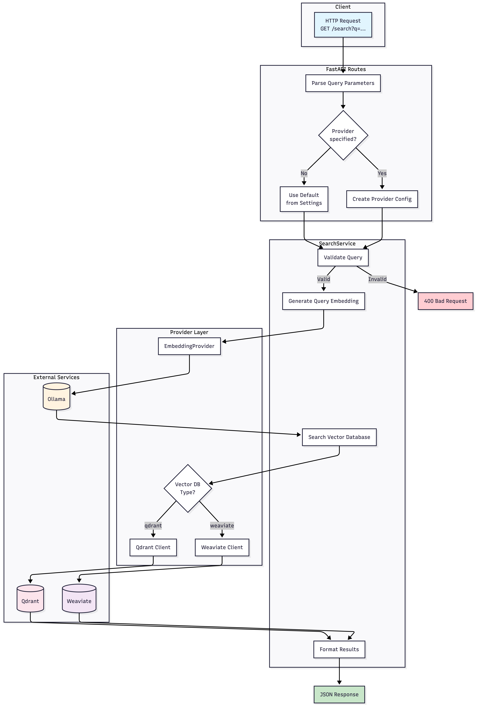
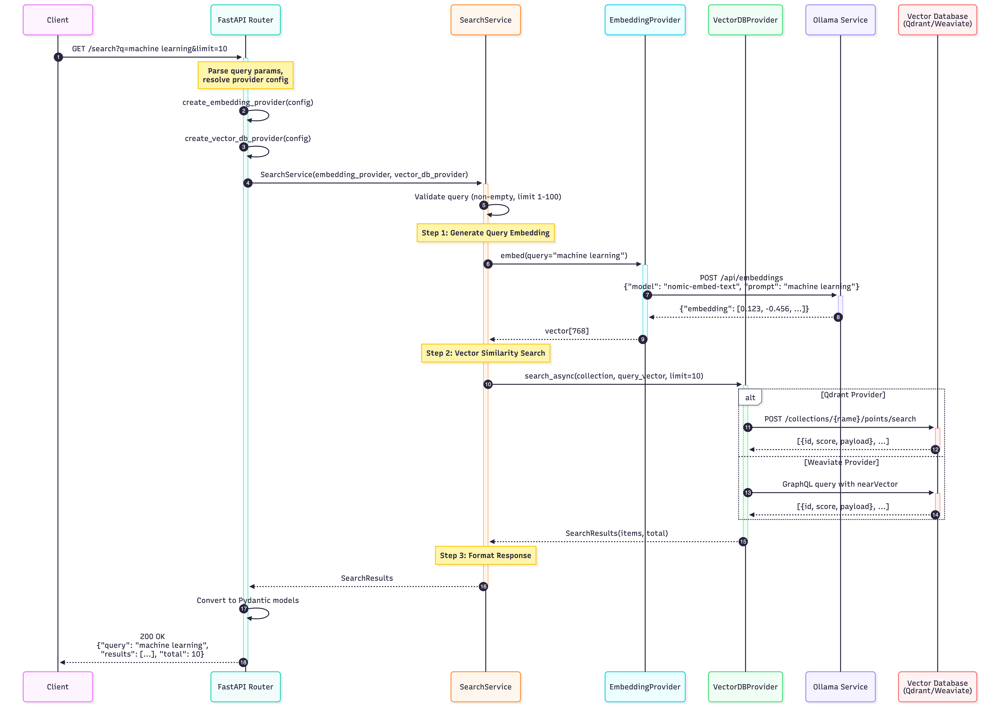
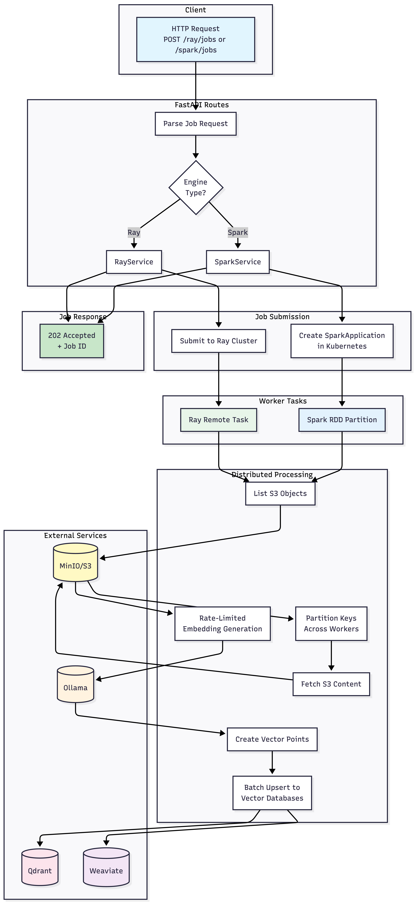

# iNatInq ML Pipeline

A semantic search and document ingestion service built with FastAPI, Ray/Spark, and vector databases.

## Overview

This service provides two core capabilities:

| Capability | Description |
|------------|-------------|
| **Query Engine** | Semantic search over documents using vector similarity |
| **Ingestion Engine** | Distributed processing of S3 documents into vector databases |

**Stack**: FastAPI · Ray · Spark · CLIP · Qdrant · MinIO

---

## Query Engine

The query engine handles semantic search requests by generating embeddings and performing vector similarity search.



<details>
<summary>Sequence Diagram</summary>



</details>

**Endpoints**:

- `GET /search/images?q=sunset over ocean&limit=10` – Text-to-image search using CLIP

**Flow**: HTTP Request → Embedding (CLIP/Infinity) → Vector Search → Ranked Results

---

## Ingestion Engine

The ingestion engine processes documents from S3 into vector databases using distributed computing (Ray or Spark).



<details>
<summary>Sequence Diagram</summary>


</details>

**Endpoints**:

- `POST /ray/jobs/images` – Submit Ray image ingestion job
- `POST /ray/jobs/process-dlq` – Submit Ray DLQ processing job
- `GET /ray/jobs/{job_id}` – Get Ray job status
- `GET /ray/jobs/{job_id}/logs` – Get Ray job logs
- `DELETE /ray/jobs/{job_id}` – Stop Ray job
- `POST /databricks/jobs/images` – Submit Databricks image ingestion job
- `POST /databricks/jobs/cdc-producer` – Submit Databricks CDC producer job
- `POST /databricks/jobs/cdc-consumer` – Submit Databricks CDC consumer job
- `POST /databricks/jobs/process-dlq` – Submit Databricks DLQ processing job
- `GET /databricks/jobs/{run_id}` – Get Databricks run status
- `GET /databricks/jobs/{run_id}/logs` – Get Databricks run output
- `DELETE /databricks/jobs/{run_id}` – Stop Databricks run

**Flow**: Job Submit → S3 List → Parallel Workers → Embed → Upsert to Qdrant

---

## Configuration

iNatInq uses a layered YAML configuration system with environment variable overrides.

**Layering order** (later wins):

```
config.yaml (base) → environments/{ENV}.yaml → secrets.yaml → environment variables
```

**Quick usage:**

```bash
# Local development: defaults work out of the box
uv run inq up

# Select an environment overlay
ENV=dev uv run inq up

# Override any setting via env var (always wins)
S3_BUCKET=my-bucket ENV=dev uv run inq up
```

See [`configs/README.md`](configs/README.md) for full configuration reference and [`src/README.md`](src/README.md) for application-level details.

---

## Quick Start

```bash
# Start all services
uv run inq up

# View status
uv run inq status

# Open all dashboards
uv run inq ui all

# Stop services
uv run inq down
```

**Service Endpoints** (after `uv run inq up`):

| Service | URL |
|---------|-----|
| Pipeline API | <http://localhost:8000/docs> |
| MinIO Console | <http://localhost:9001> |
| Qdrant Dashboard | <http://localhost:6333/dashboard> |
| Ray Dashboard | <http://localhost:8265> |

### Using External Services (Optional)

External services can be configured via environment variables **or** YAML config files
in `configs/`. Environment variables always take priority over YAML values.

```bash

# Qdrant Cloud (https://cloud.qdrant.io/)
export QDRANT_URL=https://your-cluster.region.cloud.qdrant.io
export QDRANT_API_KEY=your-api-key
uv run inq docker up

# Azure Databricks (optional - for Databricks job execution/integration tests)
export DATABRICKS_HOST=https://adb-<workspace-id>.<region>.azuredatabricks.net
export DATABRICKS_TOKEN=your-databricks-token
export DATABRICKS_JOB_ID=123
export DATABRICKS_TASK_TYPE=python

# Embedding Providers
# Local ai4all/clip server:
export EMBEDDING_PROVIDER="clip"
export CLIP_URL=http://your-clip-host:8000
export CLIP_MODEL=ViT-B/32
# Hosted CLIP (Azure ML-style /score endpoint):
export EMBEDDING_PROVIDER="hosted_clip"
export CLIP_URL=https://<your-endpoint>/score
export CLIP_API_KEY=your-api-key
export CLIP_MODEL=clip-vit-base-patch32
export CLIP_VECTOR_SIZE=512

# Image Processing Settings
export IMAGE_BATCH_SIZE=10       # Images per processing batch
export IMAGE_MAX_SIZE_MB=10.0    # Reject images larger than this
export IMAGE_TARGET_SIZE=224     # Resize dimension for CLIP input

# Or use a local config file (gitignored)
cp zarf/databricks/dev/env.local.example zarf/databricks/dev/.env.local
# Edit .env.local with your Databricks credentials

# Manage the Databricks cluster (requires Databricks CLI)
uv run inq databricks build
uv run inq databricks up
uv run inq databricks down
```

Or equivalently, set these values in YAML (see `configs/README.md`):

```bash
cp configs/secrets.example.yaml configs/secrets.yaml
# Edit secrets.yaml with your credentials, then:
ENV=dev uv run inq docker up
```

For full Databricks setup details, see `zarf/databricks/README.md`.

---

## Developer Guide

### Prerequisites

- Docker & Docker Compose
- Python 3.11+
- [uv](https://github.com/astral-sh/uv) (recommended)

### Setup

```bash
# Install dependencies
uv sync

# Run tests
uv run inq test unit

# Run with coverage
uv run inq test cov

# Lint & format
uv run inq dev lint
uv run inq dev format
```

### Running Locally (without Docker)

```bash
# Start dev server
uv run inq dev serve

# Or directly
uv run uvicorn api.app:app --reload --port 8000
```

### End-to-End Testing

Seed MinIO with synthetic images and run a complete ingestion + search test:

```bash
# 1. Start all services
uv run inq docker up

# 2. Generate & upload test images (100 by default)
uv run inq synthetic setup --count 100

# 3. Submit a Ray image ingestion job
curl -X POST http://localhost:8000/ray/jobs/images \
  -H "Content-Type: application/json" \
  -d '{"s3_bucket": "pipeline", "s3_prefix": "images/", "collection": "documents"}'

# 4. Check job status (use job_id from step 3)
curl http://localhost:8000/ray/jobs/<job_id>

# 5. Search the indexed images
curl "http://localhost:8000/search/images?q=red+circle&limit=5"
```

**One-liner** (generate + upload + ingest + search):

```bash
uv run inq synthetic setup --count 100 && \
  curl -s -X POST http://localhost:8000/ray/jobs/images \
    -H "Content-Type: application/json" \
    -d '{"s3_bucket": "pipeline", "s3_prefix": "images/", "collection": "documents"}' | jq .
```

See [bench/synthetic/README.md](bench/synthetic/README.md) for more options.

### Viewing Ray Worker Logs

Ray jobs have two types of logs:

| Log Type | Contains | Access Method |
|----------|----------|---------------|
| **Driver Logs** | Job orchestration, progress updates | Job Logs API, Dashboard |
| **Worker Logs** | Task execution, circuit breaker events, errors | Worker log files |

**Accessing worker logs by deployment:**

| Deployment | Command |
|------------|---------|
| **Ray Dashboard** | Jobs → Select job → Logs tab → Worker logs |
| **Local** | `cat /tmp/ray/session_latest/logs/worker-*.out` |
| **Docker** | `docker exec ray-head bash -c 'cat /tmp/ray/session_latest/logs/worker-*.out'` |
| **Kubernetes** | `kubectl logs <ray-worker-pod>` or Ray Dashboard |

**Filtering for errors:**

```bash
# Docker: Find circuit breaker and upstream errors
docker exec ray-head bash -c 'cat /tmp/ray/session_latest/logs/worker-*.out | grep -iE "(CIRCUIT_BREAKER|UPSTREAM_ERROR)"'

# Local: Same pattern
cat /tmp/ray/session_latest/logs/worker-*.out | grep -iE "(CIRCUIT_BREAKER|UPSTREAM_ERROR)"
```

---

## Codebase Structure

```
iNatInq/
├── src/
│   ├── api/              # FastAPI routes and models
│   ├── clients/          # External service clients (S3, Qdrant, CLIP, etc.)
│   ├── core/             # Domain logic
│   │   ├── ingestion/    # Ray & Spark processing pipelines
│   │   └── services/     # Business logic (search, job orchestration)
│   ├── foundation/       # Utilities (retry, circuit breaker, logging)
│   ├── config.py         # Pydantic settings (reads env vars)
│   └── config_loader.py  # YAML config → env var bridging
├── configs/              # YAML configuration files
│   ├── config.yaml       # Base defaults
│   ├── environments/     # Per-environment overrides (dev, staging, prod)
│   └── schemas/          # JSON Schema for validation
├── tests/unit/           # Unit tests
├── bench/                # Benchmarks, synthetic data & tooling
├── charts/               # Architecture diagrams
└── zarf/                 # Docker & infrastructure
    ├── compose/dev/      # Docker Compose config
    └── docker/dev/       # Dockerfiles
```

### Module READMEs

| Module | Description |
|--------|-------------|
| [src/](src/README.md) | Application source and configuration guide |
| [configs/](configs/README.md) | YAML configuration files and layering |
| [api/](src/api/README.md) | HTTP endpoints and middleware |
| [clients/](src/clients/README.md) | Service client abstractions |
| [core/](src/core/README.md) | Domain models and exceptions |
| [core/services/](src/core/services/README.md) | Business logic layer |
| [foundation/](src/foundation/README.md) | Cross-cutting utilities |
| [bench/](bench/) | Benchmarks, datasets, synthetic data & tooling |
| [charts/](charts/README.md) | Architecture diagrams |
| [zarf/](zarf/README.md) | Infrastructure configs |

---

## Test Coverage

- **1500+ tests** across foundation, clients, core, and API
- **>90% code coverage**
- Uses pytest with async support and comprehensive mocking
