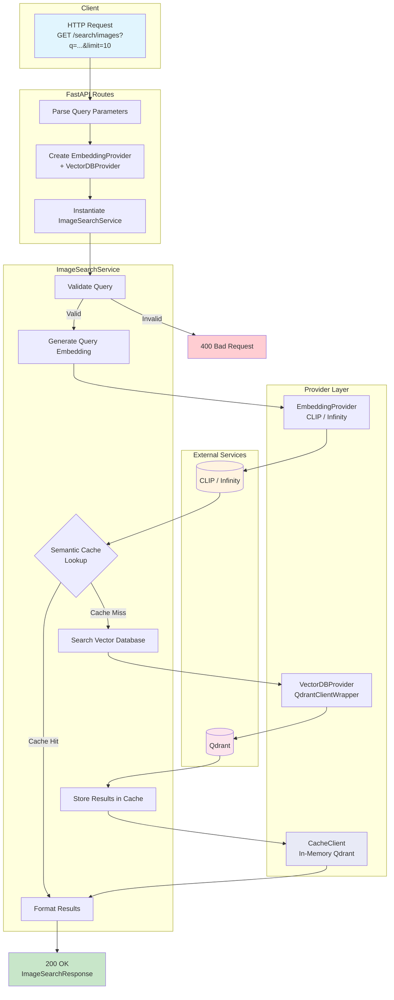
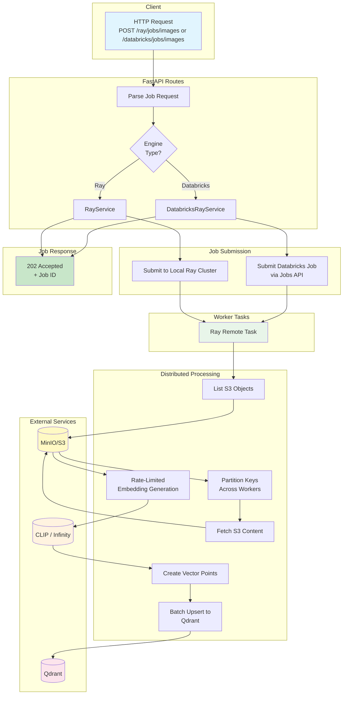

# iNatInq ML Pipeline

A semantic search and document ingestion service built with FastAPI, Ray/Spark, and vector databases.

**Stack**: FastAPI · Ray · Spark · CLIP · Qdrant · MinIO

## Overview

| Capability | Description |
|------------|-------------|
| **Query Engine** | Semantic search over documents using vector similarity |
| **Ingestion Engine** | Distributed processing of S3 documents into vector databases |

---

## Query Engine



**Flow**: HTTP Request → Embedding (CLIP/Infinity) → Cache Check → Vector Search → Ranked Results

---

## Ingestion Engine



**Flow**: Job Submit → S3 List → Parallel Workers → Embed → Upsert to Qdrant

---

## Quick Start

```bash
# Start all services
uv run inq up

# View status
uv run inq status

# Open all dashboards
uv run inq ui all

# Stop services
uv run inq down
```

**Service Endpoints** (after `uv run inq up`):

| Service | URL |
|---------|-----|
| Pipeline API | <http://localhost:8000/docs> |
| MinIO Console | <http://localhost:9001> |
| Qdrant Dashboard | <http://localhost:6333/dashboard> |
| Ray Dashboard | <http://localhost:8265> |

---

## Developer Guide

For setup, CLI reference, testing, configuration, and architecture details, see the **[Developer Guide](DEVELOPERS_GUIDE.md)**.

It covers:

1. [Local Development Environment](DEVELOPERS_GUIDE.md#1-local-development-environment) — prerequisites, install, IDE setup, code style
2. [CLI Reference](DEVELOPERS_GUIDE.md#2-cli-reference) — all `inq` commands (docker, dev, test, search, ray, bench, …)
3. [Running Tests](DEVELOPERS_GUIDE.md#3-running-tests) — unit, integration, E2E, coverage
4. [Running the Ingestion Engine](DEVELOPERS_GUIDE.md#4-running-the-ingestion-engine) — synthetic data, Ray jobs, checkpointing
5. [FastAPI Endpoints and Postman](DEVELOPERS_GUIDE.md#5-fastapi-endpoints-and-postman) — full endpoint list, Postman collections
6. [Benchmarking](DEVELOPERS_GUIDE.md#6-benchmarking) — datasets, metrics, quantization comparisons
7. [Configuration System](DEVELOPERS_GUIDE.md#7-configuration-system) — YAML layering, secrets, env var mapping
8. [Platform Features](DEVELOPERS_GUIDE.md#8-platform-features) — resilience, semantic cache, DLQ, CDC, checkpointing, metrics
9. [Architecture Overview](DEVELOPERS_GUIDE.md#9-architecture-overview) — layered architecture, patterns, Docker Compose services
10. [Troubleshooting](DEVELOPERS_GUIDE.md#10-troubleshooting) — common issues and fixes

---

## Project Structure

```
iNatInq/
├── src/
│   ├── api/              # FastAPI routes and models
│   ├── cli/              # Typer CLI (10 command groups)
│   ├── clients/          # External service clients (S3, Qdrant, CLIP, etc.)
│   ├── core/             # Domain logic
│   │   ├── ingestion/    # Ray & Spark processing pipelines
│   │   └── services/     # Business logic (search, job orchestration)
│   ├── foundation/       # Utilities (retry, circuit breaker, logging, DLQ, metrics)
│   ├── config.py         # Pydantic settings (reads env vars)
│   └── config_loader.py  # YAML config → env var bridging
├── configs/              # YAML configuration files
│   ├── config.yaml       # Base defaults
│   ├── environments/     # Per-environment overrides (dev, staging, prod)
│   └── schemas/          # JSON Schema for validation
├── tests/
│   ├── unit/             # Unit tests (~1400, no Docker needed)
│   ├── integration/      # Integration tests (testcontainers)
│   └── e2e/              # End-to-end tests (full stack)
├── bench/                # Benchmarks, synthetic data & tooling
├── charts/               # Architecture diagrams (Mermaid)
├── postman/              # Postman collections and environments
└── zarf/                 # Docker & infrastructure
    ├── compose/dev/      # Docker Compose config
    ├── docker/           # Dockerfiles
    └── databricks/       # Databricks configs
```

### Module READMEs

| Module | Description |
|--------|-------------|
| [src/](src/README.md) | Application source and configuration guide |
| [configs/](configs/README.md) | YAML configuration files and layering |
| [api/](src/api/README.md) | HTTP endpoints and middleware |
| [clients/](src/clients/README.md) | Service client abstractions |
| [core/](src/core/README.md) | Domain models and exceptions |
| [core/services/](src/core/services/README.md) | Business logic layer |
| [foundation/](src/foundation/README.md) | Cross-cutting utilities |
| [bench/](bench/) | Benchmarks, datasets, synthetic data & tooling |
| [charts/](charts/README.md) | Architecture diagrams (Mermaid catalog) |
| [zarf/](zarf/README.md) | Infrastructure configs |
