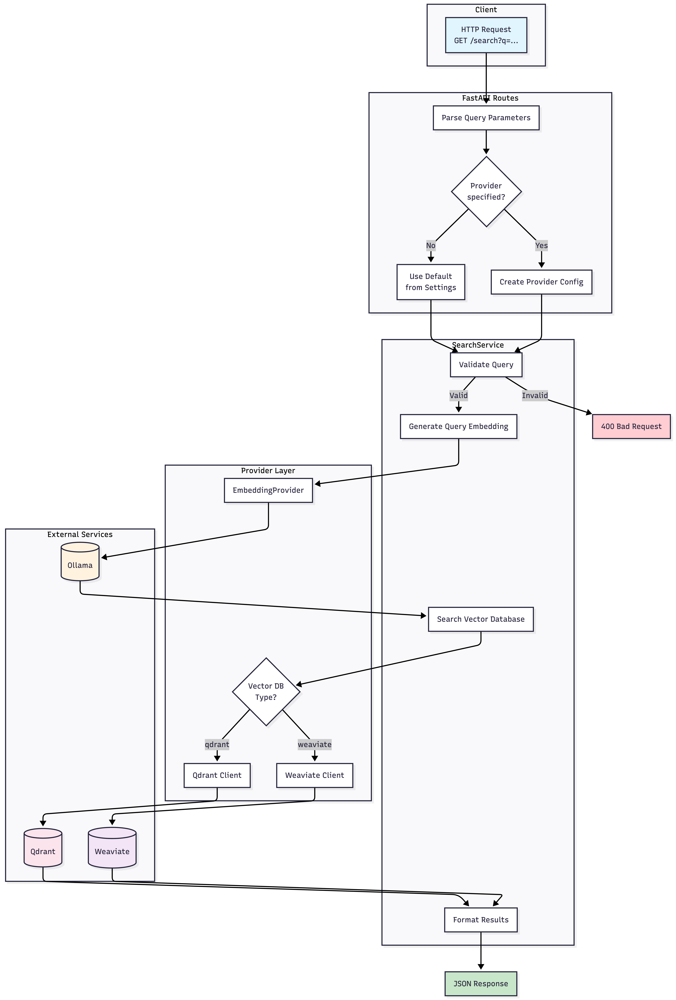
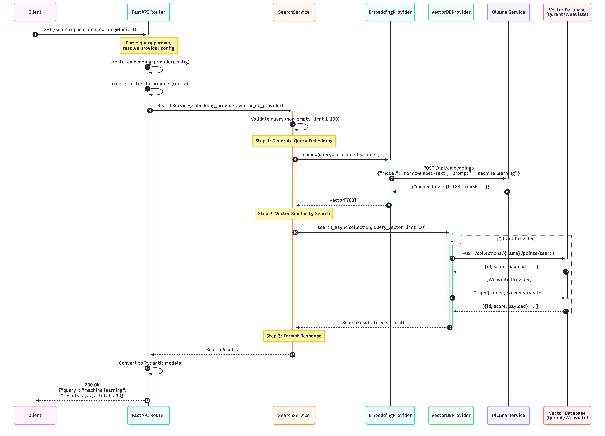
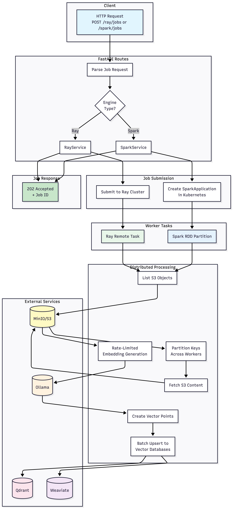

# iNatInq ML Pipeline

A semantic search and document ingestion service built with FastAPI, Ray/Spark, and vector databases.

## Overview

This service provides two core capabilities:

| Capability | Description |
|------------|-------------|
| **Query Engine** | Semantic search over documents using vector similarity |
| **Ingestion Engine** | Distributed processing of S3 documents into vector databases |

**Stack**: FastAPI · Ray · Spark · Ollama · Qdrant · Weaviate · MinIO

---

## Query Engine

The query engine handles semantic search requests by generating embeddings and performing vector similarity search.



<details>
<summary>Sequence Diagram</summary>



</details>

**Endpoint**: `GET /search?q=your query&limit=10&provider=qdrant`

**Flow**: HTTP Request → Ollama Embedding → Vector Search → Ranked Results

---

## Ingestion Engine

The ingestion engine processes documents from S3 into vector databases using distributed computing (Ray or Spark).



<details>
<summary>Sequence Diagram</summary>


</details>

**Endpoints**:

- `POST /ray/jobs` – Submit Ray job
- `POST /spark/jobs` – Submit Spark job

**Flow**: Job Submit → S3 List → Parallel Workers → Embed → Upsert to Qdrant + Weaviate

---

## Quick Start

```bash
# Start all services
make up

# View status
make status

# Open all dashboards
make ui-all

# Stop services
make down
```

**Service Endpoints** (after `make up`):

| Service | URL |
|---------|-----|
| Pipeline API | <http://localhost:8000/docs> |
| MinIO Console | <http://localhost:9001> |
| Qdrant Dashboard | <http://localhost:6333/dashboard> |
| Ray Dashboard | <http://localhost:8265> |

### Using Qdrant Cloud (Optional)

To use [Qdrant Cloud](https://cloud.qdrant.io/) instead of local Docker:

```bash
# Option 1: Environment variables
export QDRANT_URL=https://your-cluster.region.cloud.qdrant.io
export QDRANT_API_KEY=your-api-key
make docker-up

# Option 2: Local config file (gitignored)
cp apps/zarf/compose/dev/env.local.example apps/zarf/compose/dev/.env.local
# Edit .env.local with your credentials
```

---

## Developer Guide

### Prerequisites

- Docker & Docker Compose
- Python 3.11+
- [uv](https://github.com/astral-sh/uv) (recommended)

### Setup

```bash
cd apps

# Install dependencies
uv sync

# Run tests
make test

# Run with coverage
make test-cov

# Lint & format
make lint
make format
```

### Running Locally (without Docker)

```bash
# Start dev server
make dev

# Or directly
uv run uvicorn api.app:app --reload --port 8000
```

### End-to-End Testing

Seed MinIO with synthetic data and run a complete ingestion + search test:

```bash
# 1. Start all services
make docker-up

# 2. Generate & upload test documents (100 by default)
make syntheticdata-setup COUNT=100

# 3. Submit a Ray ingestion job
curl -X POST http://localhost:8000/ray/jobs \
  -H "Content-Type: application/json" \
  -d '{"s3_prefix": "inputs/", "collection": "documents"}'

# 4. Check job status (use job_id from step 3)
curl http://localhost:8000/ray/jobs/<job_id>

# 5. Search the indexed documents
curl "http://localhost:8000/search?q=whale&limit=5"
```

**One-liner** (generate + upload + ingest + search):

```bash
make syntheticdata-setup COUNT=100 && \
  curl -s -X POST http://localhost:8000/ray/jobs \
    -H "Content-Type: application/json" \
    -d '{"s3_prefix": "inputs/", "collection": "documents"}' | jq .
```

See [syntheticdata/README.md](syntheticdata/README.md) for more options.

---

## Codebase Structure

```
apps/
├── src/
│   ├── api/              # FastAPI routes and models
│   ├── clients/          # External service clients (S3, Qdrant, Ollama, etc.)
│   ├── core/             # Domain logic
│   │   ├── ingestion/    # Ray & Spark processing pipelines
│   │   └── services/     # Business logic (search, job orchestration)
│   ├── foundation/       # Utilities (retry, circuit breaker, logging)
│   └── config.py         # Pydantic settings
├── tests/unit/           # Unit tests
├── syntheticdata/        # Test data generation & S3 upload tools
├── charts/               # Architecture diagrams
└── zarf/                 # Docker & infrastructure
    ├── compose/dev/      # Docker Compose config
    └── docker/dev/       # Dockerfiles
```

### Module READMEs

| Module | Description |
|--------|-------------|
| [api/](src/api/README.md) | HTTP endpoints and middleware |
| [clients/](src/clients/README.md) | Service client abstractions |
| [core/](src/core/README.md) | Domain models and exceptions |
| [core/services/](src/core/services/README.md) | Business logic layer |
| [foundation/](src/foundation/README.md) | Cross-cutting utilities |
| [syntheticdata/](syntheticdata/README.md) | Test data generation & upload |
| [charts/](charts/README.md) | Architecture diagrams |
| [zarf/](zarf/README.md) | Infrastructure configs |

---

## Test Coverage

- **458 tests** across foundation, clients, core, and API
- **>90% code coverage**
- Uses pytest with async support and comprehensive mocking
