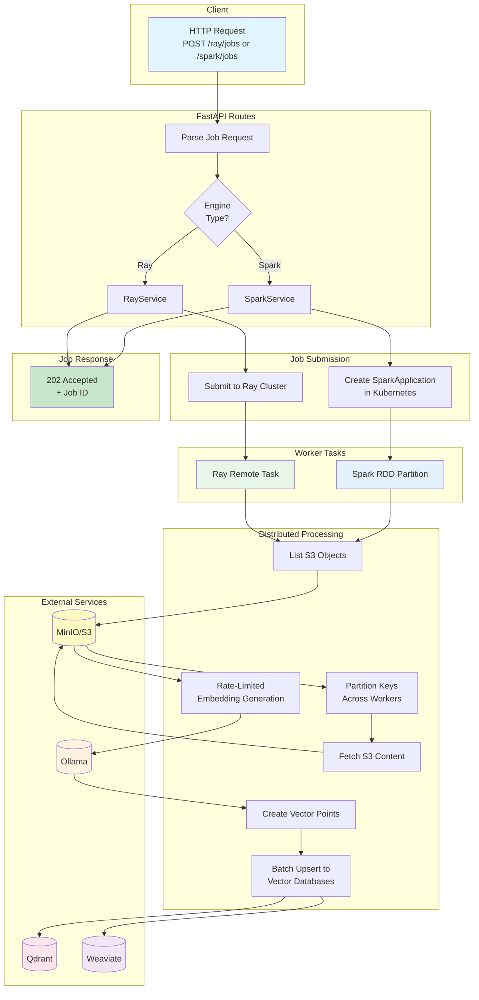

# Ingestion Engine Flow Chart

## Flow Description

1. **Client Request**: User submits ingestion job via `POST /ray/jobs` or `POST /spark/jobs`
2. **API Layer**: Routes to appropriate service (RayService or SparkService)
3. **Job Submission**: Creates distributed job in Ray cluster or Kubernetes SparkApplication
4. **Object Discovery**: Lists S3 objects matching the prefix
5. **Parallel Processing**: Partitions work across Ray tasks or Spark executors
6. **Content Fetch**: Each worker fetches assigned S3 objects
7. **Embedding Generation**: Rate-limited calls to Ollama for vector embeddings
8. **Vector Point Creation**: Constructs points with embeddings + metadata
9. **Database Upsert**: Batch upserts to both Qdrant and Weaviate
10. **Async Response**: Returns job ID immediately (202 Accepted)
