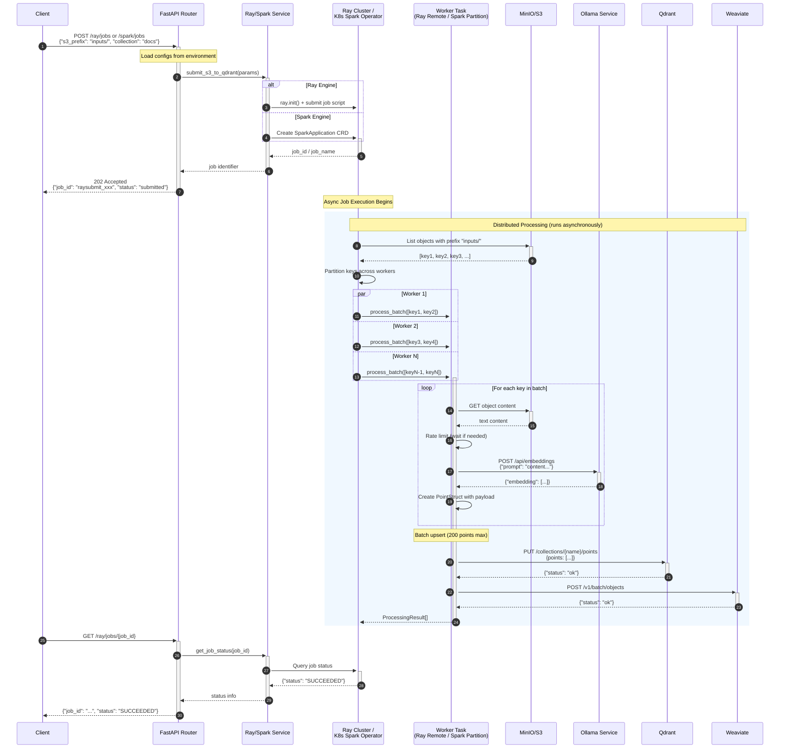

# Ingestion Engine Sequence Diagram

## Sequence Description

| Phase | Steps | Description |
| ----- | ----- | ----------- |
| **Submission** | 1-6 | Client submits job, service creates Ray/Spark job, returns immediately |
| **Discovery** | 7-8 | Job lists S3 objects matching prefix |
| **Distribution** | 9 | Keys partitioned across workers (Ray tasks or Spark executors) |
| **Processing** | 10-17 | Each worker: fetch content → rate-limit → embed → create points |
| **Upsert** | 18-21 | Batch upsert vectors to both Qdrant and Weaviate |
| **Status Check** | 22-27 | Client polls for job completion |

## Key Implementation Details

### Rate Limiting

- Configurable RPS limit to prevent Ollama overload
- Async semaphore for concurrency control
- Dynamic batch sizing (shrink on failure, grow on success)

### Fault Tolerance

- Checkpoint support for resumable processing (Spark)
- Per-key error tracking (success/failure with error message)
- Graceful degradation if one vector DB fails

### Parallelism

- **Ray**: Remote tasks with configurable batch sizes
- **Spark**: RDD partitions processed in parallel executors
