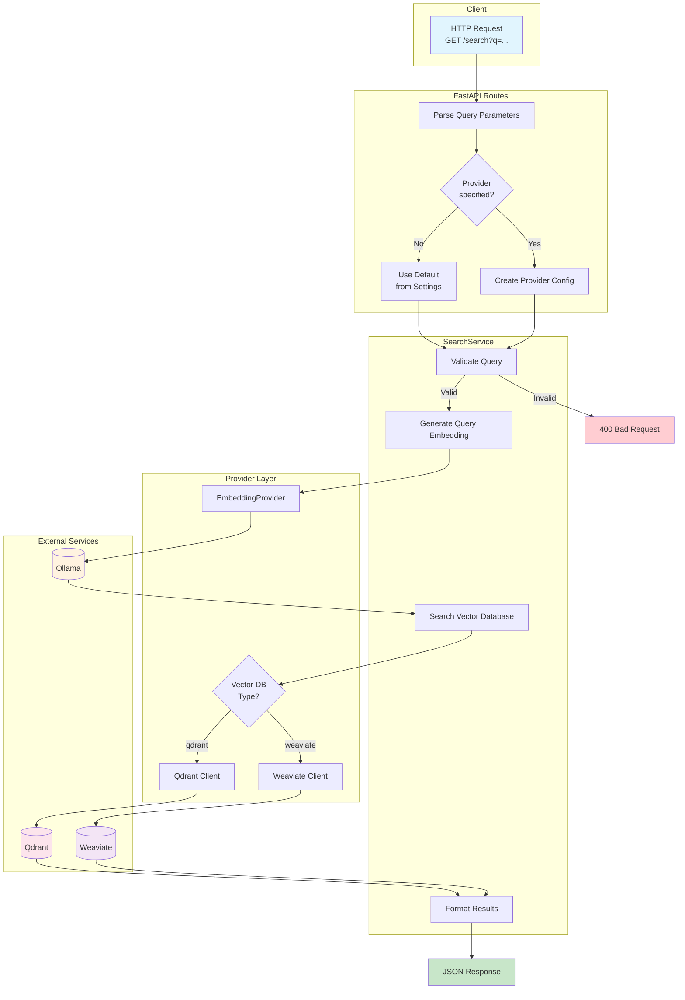

# Query Engine Flow Chart

## Flow Description

1. **Client Request**: User sends semantic search query via `GET /search?q=...`
2. **API Layer**: Parses parameters, determines vector DB provider
3. **Service Layer**: Validates query, orchestrates embedding + search
4. **Provider Layer**: Abstracts embedding and vector DB implementations
5. **External Services**: Ollama generates embeddings, Qdrant/Weaviate performs similarity search
6. **Response**: Ranked results with similarity scores returned to client
