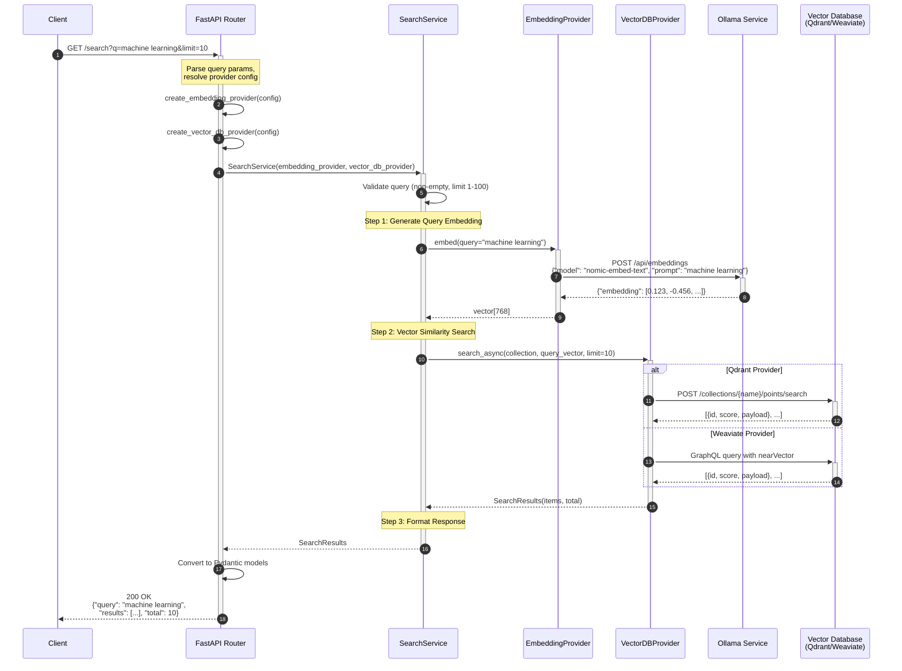

# Query Engine Sequence Diagram

## Sequence Description

| Step | Component | Action |
|------|-----------|--------|
| 1-2 | Client → API | Send search request with query and parameters |
| 3-5 | API | Create providers, instantiate SearchService |
| 6 | SearchService | Validate input (query non-empty, limit in range) |
| 7-9 | SearchService → Ollama | Generate embedding vector for query text |
| 10-13 | SearchService → VectorDB | Perform cosine similarity search |
| 14-16 | API → Client | Format and return ranked results |

## Error Handling

- **400 Bad Request**: Empty query, invalid limit, invalid provider
- **502 Bad Gateway**: Ollama or Vector DB service failure
- **404 Not Found**: Collection doesn't exist
