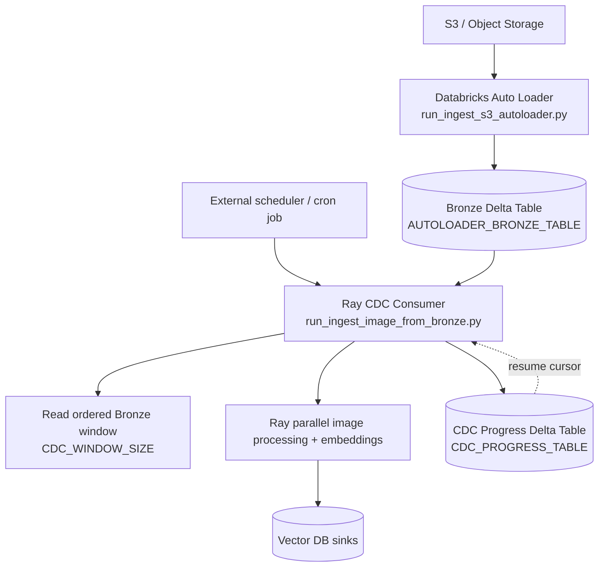

# Databricks CDC Architecture

## Design: Auto Loader Producer + Scheduled Ray Consumer

This implementation splits CDC into two separate jobs:

1. `Auto Loader` job detects arrivals from object storage and writes Bronze rows.
2. `Ray` job runs on a schedule and processes only the next incremental Bronze window.

## Why This Pattern

1. Clear separation: ingestion/discovery is independent from model compute.
2. Lower coupling: Auto Loader concerns do not leak into Ray task code.
3. Deterministic increments: Bronze + progress cursor gives repeatable windows.
4. Independent scaling: ingestion throughput and compute throughput can be tuned separately.

## Implemented Components

### Auto Loader job

- Entrypoint: `src/core/ingestion/databricks/run_ingest_s3_autoloader.py`
- Main: `src/core/ingestion/databricks/process_s3_autoloader.py`
- Responsibility:
  1. Read from derived source path `s3://$S3_BUCKET/$S3_PREFIX` using `cloudFiles`.
  2. Write normalized Bronze rows to `AUTOLOADER_BRONZE_TABLE`.
  3. Maintain streaming checkpoint/schema locations.

Bronze columns written:

1. `source_path`
2. `s3_key`
3. `source_modified_at`
4. `source_length`
5. `discovered_at`
6. `discovered_date`

### Ray CDC consumer job

- Entrypoint: `src/core/ingestion/databricks/run_ingest_image_from_bronze.py`
- Main: `src/core/ingestion/databricks/process_s3_images_from_bronze.py`
- CDC helpers: `src/core/ingestion/databricks/cdc.py`
- Responsibility:
  1. Load current cursor from `CDC_PROGRESS_TABLE`.
  2. Read next ordered Bronze window (`discovered_at`, then `s3_key`).
  3. Process keys via existing Ray image task path.
  4. Commit cursor only through the last contiguous successful record.

## Cursor and Commit Semantics

Cursor key:

1. `progress_id`
2. `source_table` (Bronze table name)
3. `collection` (vector collection)

Stored cursor values:

1. `last_discovered_at`
2. `last_s3_key`

Commit rule:

1. The consumer computes the last contiguous success from the ordered window.
2. Cursor advances only up to the first failed row boundary.
3. This avoids skipping failed rows while allowing partial success in a run.

Monotonic commit safety net (concurrent writers):

1. Progress table updates are guarded in `merge_progress_cursor` so matched rows update only when the incoming cursor is ahead.
2. Update is allowed when:
   - `source.last_discovered_at > target.last_discovered_at`, or
   - `source.last_discovered_at = target.last_discovered_at` and `source.last_s3_key > target.last_s3_key`
3. This prevents slower concurrent consumers from rewinding cursor state written by faster consumers.

## Runtime Configuration

### Auto Loader env vars

Required:

1. `S3_BUCKET`
2. `AUTOLOADER_BRONZE_TABLE`
3. `AUTOLOADER_SCHEMA_LOCATION`
4. `AUTOLOADER_CHECKPOINT_LOCATION`

Optional:

1. `S3_PREFIX`
2. `AUTOLOADER_FILE_FORMAT` (default: `binaryFile`)
3. `AUTOLOADER_INCLUDE_EXISTING_FILES` (default: `true`)
4. `AUTOLOADER_MAX_FILES_PER_TRIGGER`
5. `AUTOLOADER_TRIGGER_MODE` (`availableNow`, `once`, `processingTime`)
6. `AUTOLOADER_TRIGGER_INTERVAL` (used for `processingTime`)

### Ray CDC consumer env vars

Required:

1. `AUTOLOADER_BRONZE_TABLE`

Optional:

1. `CDC_PROGRESS_TABLE` (default: `<bronze_table>_progress`)
2. `CDC_PROGRESS_ID` (default: `s3_bronze_image_ingestion`)
3. `CDC_WINDOW_SIZE` (default: `5000`)
4. `CDC_KEY_COL` (default: `s3_key`)
5. `CDC_WATERMARK_COL` (default: `discovered_at`)

The Ray consumer also uses the existing image pipeline env vars (`S3_*`, `VECTOR_DB_*`, `RAY_*`, `CLIP_*`).

## Scheduler Recommendation

Run the two jobs independently:

1. Auto Loader job: continuous or `availableNow` cadence.
2. Ray CDC consumer: fixed schedule every N minutes with non-overlapping runs.
