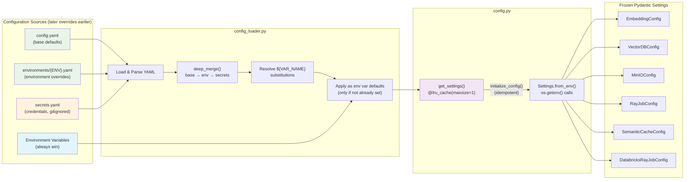
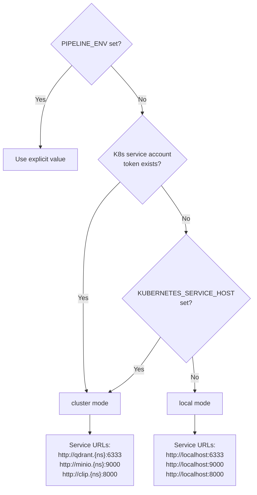

# Configuration Layering Diagram

Shows the merge order of YAML configs and environment variables, and how they flow into the application.



## Layering Order

```
hardcoded defaults < config.yaml < environments/{ENV}.yaml < secrets.yaml < env vars
```

| Priority | Source | Purpose | Example |
|----------|--------|---------|---------|
| 1 (lowest) | Hardcoded defaults | Fallback values in `from_env()` methods | `QDRANT_URL` defaults to `localhost:6333` |
| 2 | `configs/config.yaml` | Base configuration shared across all environments | Storage bucket, batch sizes, HNSW params |
| 3 | `configs/environments/{ENV}.yaml` | Environment-specific overrides | Production endpoint URLs, SSL settings |
| 4 | `configs/secrets.yaml` | Credentials (gitignored) | API keys, passwords |
| 5 (highest) | Environment variables | Runtime overrides, always win | `QDRANT_URL=http://qdrant:6333` |

## Environment Selection

Set `ENV` or `PIPELINE_ENV` to select the environment overlay:

```bash
ENV=prod uv run inq up    # Loads configs/environments/prod.yaml
ENV=dev uv run inq up     # Loads configs/environments/dev.yaml
# No ENV set               # Loads configs/environments/local.yaml (default)
```

## Auto-Detection

`_is_in_cluster()` in `config.py` auto-detects the runtime environment:



## Key Behaviors

- `initialize_config()` is **idempotent** — safe to call multiple times
- `get_settings()` is **cached** via `@lru_cache(maxsize=1)` — one Settings instance per process
- `${VAR_NAME}` syntax in YAML values is resolved from `os.environ` at load time
- Missing YAML files are silently skipped (graceful degradation)
- Env vars set before `initialize_config()` always take precedence over YAML values
