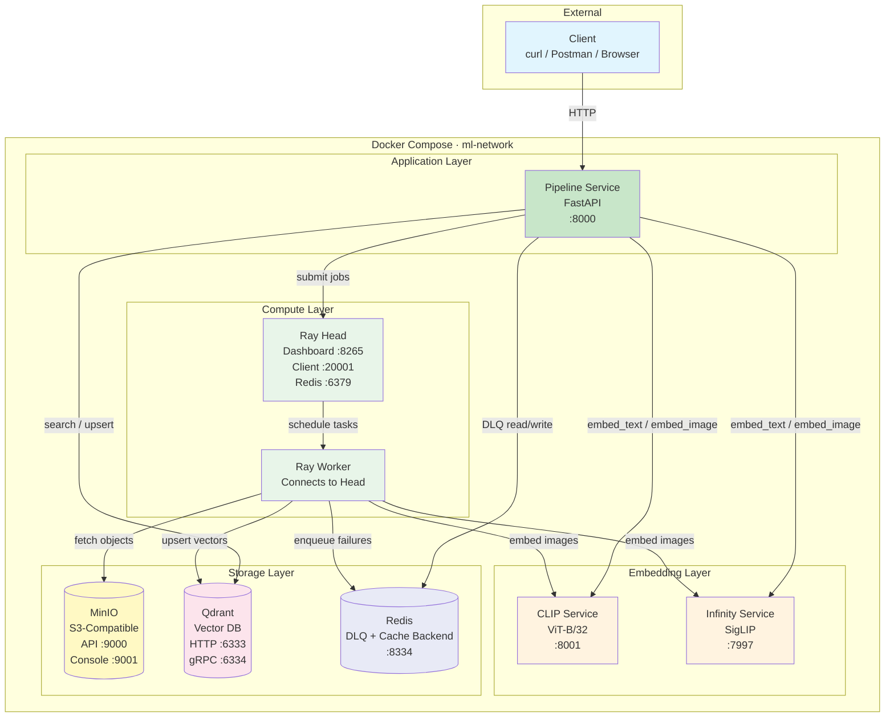

# Infrastructure & Deployment Diagram

C4-style container diagram showing all services, ports, and data flows in the local development environment.

## Services

| Service | Image | Ports | Role | Resources |
|---------|-------|-------|------|-----------|
| **pipeline** | Custom (Dockerfile.pipeline) | 8000 | FastAPI API server — routes, middleware, service orchestration | — |
| **ray-head** | rayproject/ray:2.53.0-py311 | 8265, 20001, 6379 | Ray control plane — job scheduling, dashboard | 2 CPU / 8 GB |
| **ray-worker** | rayproject/ray:2.53.0-py311 | — (internal) | Ray data plane — executes remote tasks | 4 CPU / 7 GB |
| **clip** | ai4all/clip:latest | 8001 | CLIP embedding service (ViT-B/32, 512-dim vectors) | 2 CPU / 4 GB |
| **infinity** | michaelf34/infinity:latest | 7997 | Infinity embedding service (SigLIP, 768-dim vectors) | 2 CPU / 6 GB |
| **minio** | minio:latest | 9000, 9001 | S3-compatible object storage for images and data | — |
| **qdrant** | qdrant:v1.16.3 | 6333, 6334 | Vector database for similarity search | — |
| **redis** | redis:8.6 | 8334 | Dead Letter Queue backend + general cache | — |

## Data Flows

| Flow | Path | Protocol |
|------|------|----------|
| **Search Query** | Client → Pipeline → CLIP/Infinity → Qdrant → Client | HTTP REST |
| **Job Submission** | Client → Pipeline → Ray Head | HTTP REST |
| **Image Ingestion** | Ray Worker → MinIO (fetch) → CLIP/Infinity (embed) → Qdrant (upsert) | HTTP REST |
| **DLQ Write** | Ray Worker → Redis (on failure) | Redis protocol |
| **DLQ Recovery** | Client → Pipeline → Ray Head → Worker → Redis (read) → reprocess | HTTP + Redis |
| **Metrics** | Pipeline → /metrics (Prometheus scrape) | HTTP |

## Network

All services communicate over the `ml-network` Docker bridge network. Service discovery uses Docker Compose DNS (e.g., `http://clip:8001`, `http://qdrant:6333`).
