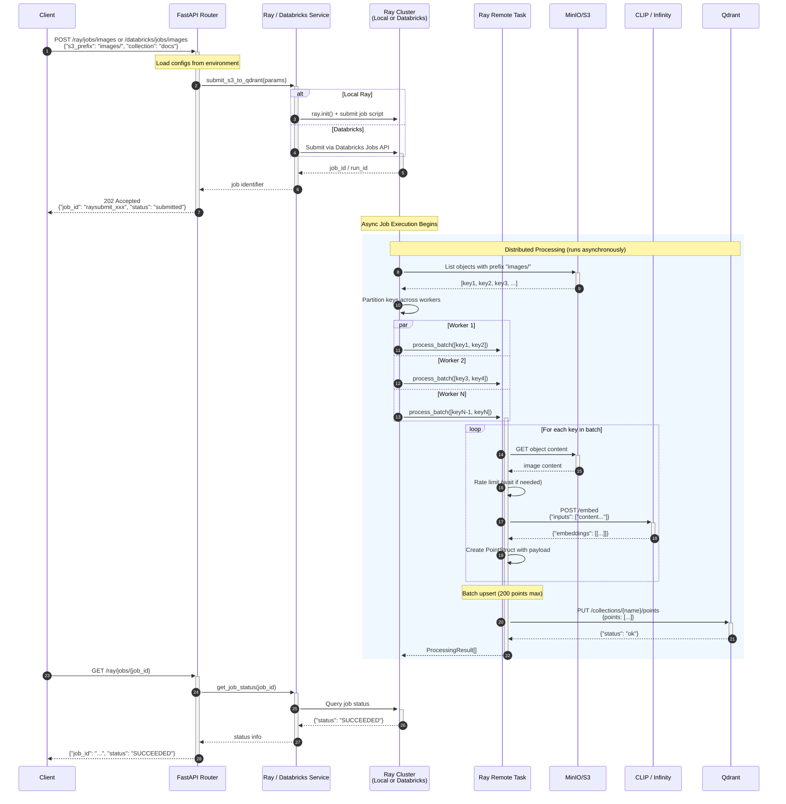

# Ingestion Engine Sequence Diagram

## Sequence Description

| Phase | Steps | Description |
| ----- | ----- | ----------- |
| **Submission** | 1-6 | Client submits job, service creates Ray job (local or Databricks), returns immediately |
| **Discovery** | 7-8 | Job lists S3 objects matching prefix |
| **Distribution** | 9 | Keys partitioned across Ray remote tasks |
| **Processing** | 10-17 | Each worker: fetch content → rate-limit → embed → create points |
| **Upsert** | 18-19 | Batch upsert vectors to Qdrant |
| **Status Check** | 22-27 | Client polls for job completion |

## Key Implementation Details

### Rate Limiting

- Configurable RPS limit to prevent embedding service overload
- Async semaphore for concurrency control
- Dynamic batch sizing (shrink on failure, grow on success)

### Fault Tolerance

- Checkpoint support for resumable processing
- Per-key error tracking (success/failure with error message)
- Dead Letter Queue (DLQ) for failed items

### Parallelism

- **Local Ray**: Remote tasks with configurable batch sizes
- **Databricks**: Ray on Spark cluster with distributed workers
