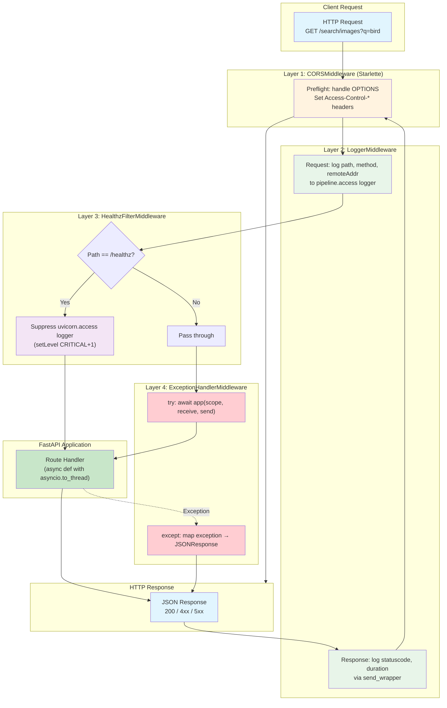
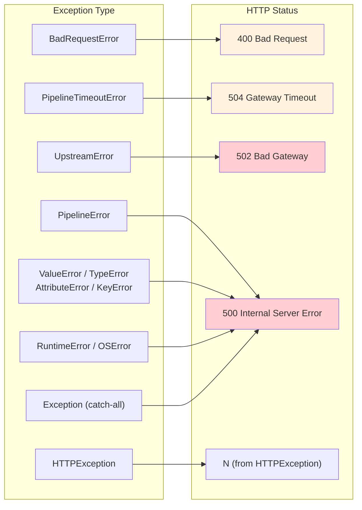

# Middleware Stack Diagram

Shows the ASGI middleware pipeline order: how requests flow inward through each layer and responses flow back out (onion model).

## Middleware Registration Order

Middleware is registered in `src/api/app.py`. Starlette processes middleware in **reverse registration order** for inbound requests (last registered = closest to the route handler):

| Registration Order | Class | Inbound Behavior | Outbound Behavior |
|---|---|---|---|
| 1st | `CORSMiddleware` | Handle CORS preflight, set headers | Add `Access-Control-*` headers |
| 2nd | `LoggerMiddleware` | Log request start (path, method, IP) | Log response (status, duration) via `send` wrapper |
| 3rd | `HealthzFilterMiddleware` | Suppress `uvicorn.access` for `/healthz` | Restore logger level |
| 4th | `ExceptionHandlerMiddleware` | Wrap inner app in `try/except` | Map exceptions to JSON responses |

## Exception Mapping

The `ExceptionHandlerMiddleware` converts Python exceptions to HTTP status codes:

## Key Design Decisions

- **Pure ASGI classes** (not `BaseHTTPMiddleware`) — avoids per-request thread overhead and memory stream buffering
- **`send` wrapper** in `LoggerMiddleware` captures status code from the `http.response.start` ASGI message without buffering the full response
- **Logger suppression** in `HealthzFilterMiddleware` uses `setLevel(CRITICAL+1)` to silence health probe noise at the source, restored in a `finally` block
- **Prometheus metrics** (`/metrics`) are added separately via `prometheus-fastapi-instrumentator`, not as middleware
