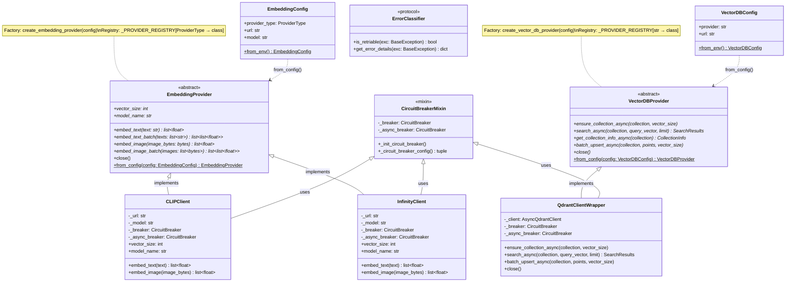

# Provider Abstraction Class Diagram

Shows the ABC pattern for embedding and vector DB providers, with factory functions and registry.



## Key Concepts

### Factory + Registry Pattern

Providers register themselves at import time via `register_provider()`. The factory function looks up the provider class by type and calls `from_config()`:

```
EmbeddingConfig(provider_type="clip")
    → _PROVIDER_REGISTRY["clip"] → CLIPClient
    → CLIPClient.from_config(config) → instance
```

### Adding a New Provider

1. Create class inheriting from `EmbeddingProvider` or `VectorDBProvider`
2. Implement all abstract methods
3. Call `register_provider("my_provider", MyProvider)` at module level
4. Add `ProviderType` enum value in `config.py`

### Circuit Breaker Integration

Every client uses dual circuit breakers (sync + async) via `CircuitBreakerMixin`:
- `@with_circuit_breaker("service")` wraps sync methods
- `@with_circuit_breaker_async("service")` wraps async methods
- `CircuitBreakerError` → `UpstreamError` conversion is automatic
