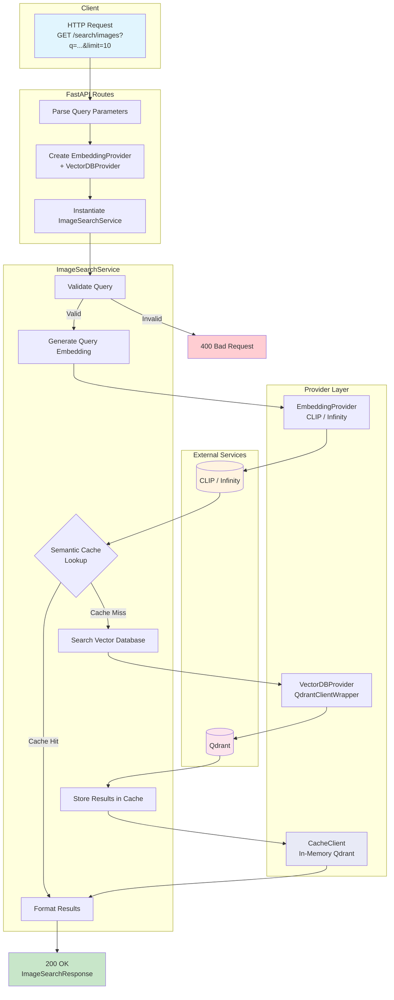

# Query Engine Flow Chart

## Flow Description

1. **Client Request**: User sends semantic search query via `GET /search/images?q=...&limit=10`
2. **API Layer**: Parses parameters, creates embedding and vector DB providers via factory functions
3. **Service Layer**: `ImageSearchService` validates query, orchestrates embedding + cache + search
4. **Embedding**: Generates query vector via `EmbeddingProvider` (CLIP or Infinity)
5. **Cache Check**: Looks up query embedding in semantic cache (cosine similarity >= 0.95 threshold)
6. **Cache Hit**: Returns cached results immediately (skips vector DB)
7. **Cache Miss**: Searches Qdrant for similar vectors, stores results in cache for future queries
8. **Response**: Returns `ImageSearchResponse` with ranked results and similarity scores
