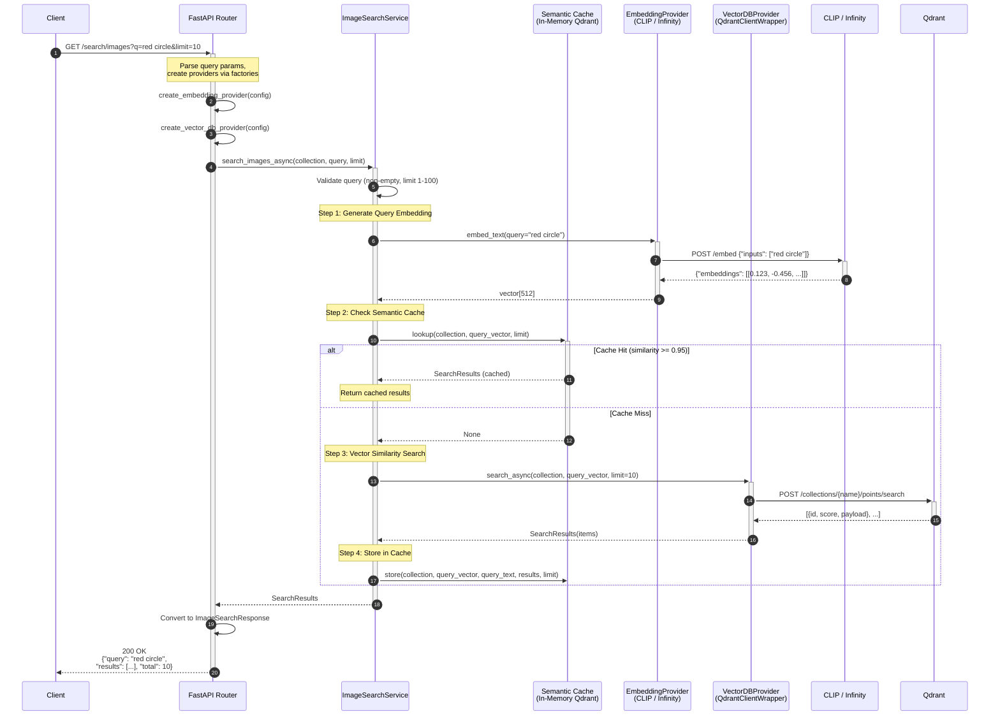

# Query Engine Sequence Diagram

## Sequence Description

| Step | Component | Action |
| ---- | --------- | ------ |
| 1-2 | Client → API | Send search request with query and parameters |
| 3-5 | API | Create providers via factory, instantiate ImageSearchService |
| 6 | ImageSearchService | Validate input (query non-empty, limit in range) |
| 7-9 | ImageSearchService → Embedding | Generate embedding vector for query text |
| 10 | ImageSearchService → Cache | Cosine similarity lookup against cached queries |
| 11 | (Cache Hit) | Return stored results, skip vector DB |
| 12-15 | (Cache Miss) → VectorDB | Perform cosine similarity search in Qdrant |
| 16 | ImageSearchService → Cache | Store results for future similar queries |
| 17-18 | API → Client | Format and return ranked results |

## Error Handling

- **400 Bad Request**: Empty query, invalid limit, invalid provider
- **502 Bad Gateway**: CLIP/Infinity or Qdrant service failure (UpstreamError)
- **504 Gateway Timeout**: Operation timeout (PipelineTimeoutError)

## Semantic Cache Details

- **Backend**: In-memory Qdrant instance (`:memory:`)
- **Similarity threshold**: 0.95 (configurable via `SEMANTIC_CACHE_SIMILARITY_THRESHOLD`)
- **Max entries**: 1000 per collection (random eviction at capacity)
- **Invalidation**: `DELETE /cache` endpoint or automatic sweep every 3600s
- **Graceful degradation**: Cache failures are logged and swallowed; search continues without cache
