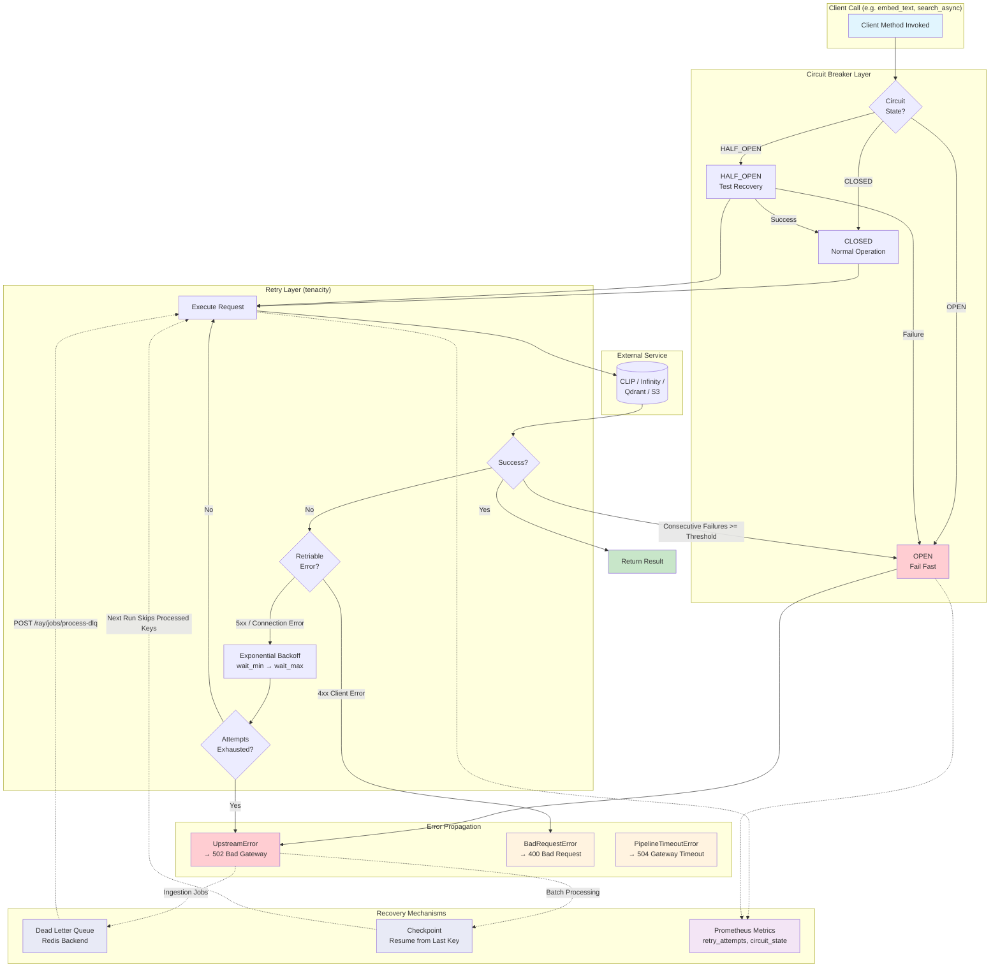

# Resilience & Error Handling Flow

Shows how the layered resilience stack composes: retry → circuit breaker → DLQ → checkpoint.

## Resilience Layers (Inside → Outside)

| Layer | Component | Behavior |
|-------|-----------|----------|
| **Circuit Breaker** | `@with_circuit_breaker` / `@with_circuit_breaker_async` | Fails fast when service is degraded. CLOSED → OPEN after N failures, auto-recovers via HALF_OPEN. |
| **Retry** | `RetryWithBackoff` / `async_retry_call` (tenacity) | Exponential backoff for transient errors (5xx, connection). Non-retriable errors (4xx) fail immediately. |
| **Error Classification** | `ErrorClassifier` protocol | Per-client logic determines retriable vs permanent. S3, Qdrant, CLIP each have custom classifiers. |
| **DLQ** | `@with_dlq` decorator → Redis | Captures failed image ingestions for later reprocessing via dedicated API endpoints. |
| **Checkpoint** | `foundation/checkpoint.py` | Tracks processed S3 keys; next run resumes from last checkpoint. |
| **Metrics** | Prometheus counters/gauges | `retry_attempts_total`, `retry_exhaustions_total`, `circuit_breaker_state`, `circuit_breaker_transitions` |

## Circuit Breaker Configuration

| Service | Failure Threshold | Recovery Timeout | Rationale |
|---------|-------------------|-----------------|-----------|
| CLIP / Infinity | 5 | 30s | Critical path, fail fast |
| Qdrant | 3 | 60s | Database issues are serious |
| S3 / MinIO | 5 | 120s | Transient network issues common |

## Error → HTTP Status Mapping (ExceptionHandlerMiddleware)

| Exception | HTTP Status | When |
|-----------|-------------|------|
| `BadRequestError` | 400 | Invalid query, bad parameters |
| `UpstreamError` | 502 | Service failure, retries exhausted, circuit open |
| `PipelineTimeoutError` | 504 | Operation timeout |
| `PipelineError` | 500 | Unexpected application error |
