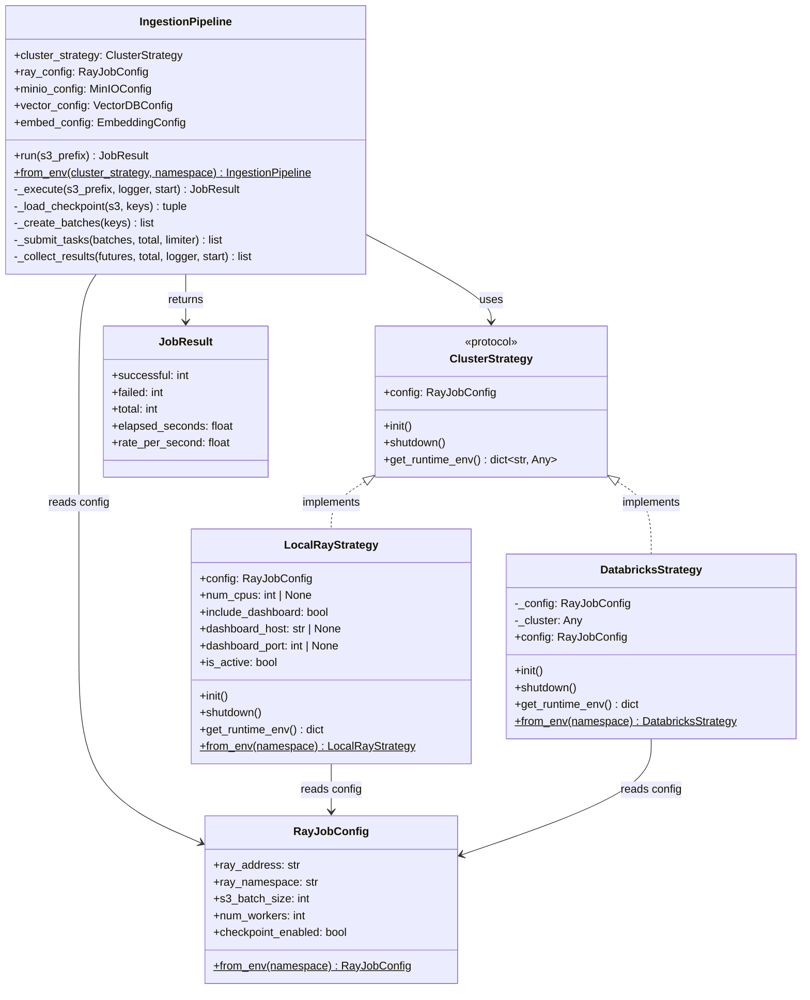
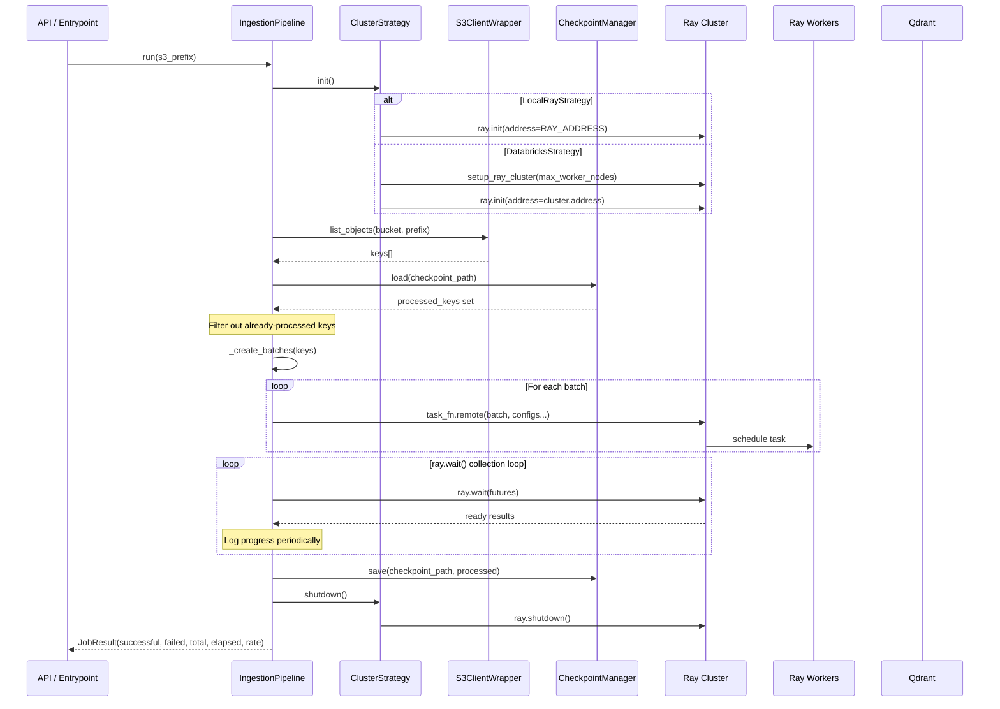

# Strategy Pattern / Ingestion Architecture

Shows how the `IngestionPipeline` uses the Strategy Pattern to abstract Ray cluster lifecycle across local and Databricks environments.



## Pipeline Execution Flow



## Strategy Comparison

| Aspect | LocalRayStrategy | DatabricksStrategy |
|--------|------------------|--------------------|
| **Cluster Lifecycle** | Connects to existing cluster via `RAY_ADDRESS` | Creates Ray-on-Spark cluster via `setup_ray_cluster()` |
| **Runtime Env** | Config-provided `runtime_env` dict | Auto-builds with `PYTHONPATH`, passthrough env vars, `INATINQ_SRC_DIR` working dir |
| **Shutdown** | `ray.shutdown()` only (doesn't own cluster) | `ray.shutdown()` + `cluster.shutdown()` (owns the Spark cluster) |
| **Context Manager** | Yes (`__enter__`/`__exit__`) | No |
| **Use Case** | Local dev (Docker Compose), K8s deployments | Azure Databricks production jobs |

## Adding a New Strategy

1. Create `src/core/ingestion/strategies/my_strategy.py`
2. Implement the `ClusterStrategy` protocol:
   ```python
   @attrs.define
   class MyStrategy:
       config: RayJobConfig

       def init(self) -> None: ...
       def shutdown(self) -> None: ...
       def get_runtime_env(self) -> dict[str, Any]: ...
   ```
3. Wire it into the appropriate entrypoint or service
4. No changes needed to `IngestionPipeline` — it depends on the protocol, not concrete classes
