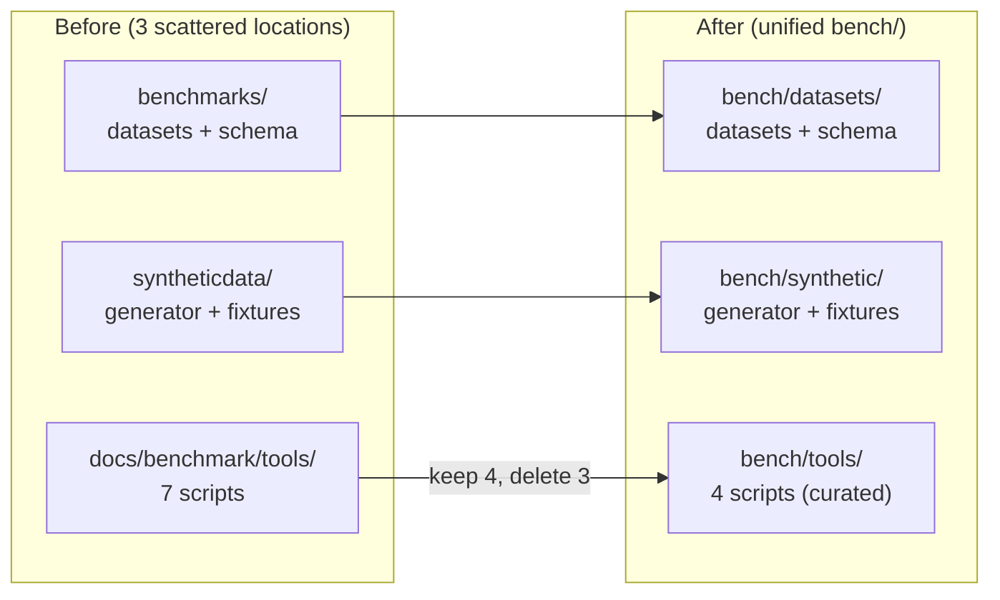

# Consolidate bench/ Directory Implementation Plan

Created: 2026-03-31
Status: PENDING
Approved: No
Iterations: 0
Worktree: No

> **Status Lifecycle:** PENDING → COMPLETE → VERIFIED
> **Iterations:** Tracks implement→verify cycles (incremented by verify phase)

## Summary

**Goal:** Unify `benchmarks/`, `syntheticdata/`, and curated scripts from `docs/benchmark/tools/` into a single `bench/` top-level directory. Delete dead code, merge duplicated benchmark runners, and update all cross-codebase path references.

**Architecture:** Pure file reorganization + one script refactor. Three source locations become three subdirectories under `bench/`: `datasets/` (gold-standard JSONs), `synthetic/` (image generator + fixtures), `tools/` (benchmark scripts + embedding server). The `docs/benchmark/` documentation (results, methodology, runbooks) stays in place.

**Tech Stack:** Python · git mv · ruff · pytest

## Architecture Diagram



## Scope

### In Scope

- Move `benchmarks/` → `bench/datasets/` (git mv)
- Move `syntheticdata/` → `bench/synthetic/` (git mv)
- Move 4 scripts + README from `docs/benchmark/tools/` → `bench/tools/`
- Delete `prepare_local_benchmark.py` and `prepare_local_benchmark_fast.py` (dead — remote MinIO decommissioned)
- Delete `run_clip_quantization_benchmark.py` (merge into SigLIP variant)
- Merge benchmark runners: add `--provider clip|infinity` and `--collection-prefix` flags
- Update all path references across ~20 files
- Update `.gitignore`, `pyproject.toml`, `README.md`, `CLAUDE.md`

### Out of Scope

- `docs/benchmark/` documentation (results, methodology, runbooks, demo) — stays in `docs/`
- Refactoring `generate_inquire_subset.py` to use `QdrantClientWrapper` (it takes `--qdrant-api-key` which the wrapper doesn't support)
- Refactoring `setup_quantization_collections.py` to use the wrapper (intentionally standalone admin tool)
- Changes to `src/core/benchmark/` (the benchmark framework code stays where it is)

## Prerequisites

- None — this is a file reorganization with no runtime dependencies

## Context for Implementer

- **Patterns to follow:** Use `git mv` for all moves to preserve file history
- **Conventions:** Path references use `Path(__file__).resolve().parents[N] / "dir"` pattern in tests (see `tests/unit/core/benchmark/test_sample_dataset.py:16`); CLI delegates use string paths (see `src/cli/synthetic.py:26`)
- **Key files:**
  - `src/cli/synthetic.py` — CLI wrapper that shells out to `syntheticdata/synthetic_data.py` (4 hardcoded paths)
  - `tests/integration/benchmark/conftest.py` — 3 path constants for fixtures
  - `.gitignore` lines 24-28 — exception patterns for committed INQUIRE fixtures
  - `pyproject.toml` line 153 — ruff per-file-ignores for `syntheticdata/*`
- **Gotchas:**
  - `bench/tools/` scripts use `sys.path.insert(0, "src")` — this still works from repo root after the move
  - The `.gitignore` at `syntheticdata/.gitignore` uses relative paths and moves with `git mv` without changes
  - `syntheticdata/data/benchmark-images/` is gitignored (~2 GB on disk) — won't physically move with `git mv`

## Feature Inventory

### Files Being Moved/Deleted

| Source | Destination | Action |
|--------|-------------|--------|
| `benchmarks/` (7 JSON + schema) | `bench/datasets/` | git mv |
| `syntheticdata/` (generator, fixtures) | `bench/synthetic/` | git mv |
| `docs/benchmark/tools/run_quantization_benchmark.py` | `bench/tools/` | git mv + refactor |
| `docs/benchmark/tools/setup_quantization_collections.py` | `bench/tools/` | git mv |
| `docs/benchmark/tools/generate_inquire_subset.py` | `bench/tools/` | git mv |
| `docs/benchmark/tools/siglip2_server.py` | `bench/tools/` | git mv |
| `docs/benchmark/tools/README.md` | `bench/tools/` | git mv + rewrite |
| `docs/benchmark/tools/prepare_local_benchmark.py` | — | Delete |
| `docs/benchmark/tools/prepare_local_benchmark_fast.py` | — | Delete |
| `docs/benchmark/tools/run_clip_quantization_benchmark.py` | — | Delete (merged) |

### Path References to Update

| File | What Changes |
|------|-------------|
| `src/cli/synthetic.py` | 4 path strings → `bench/synthetic/...` |
| `tests/integration/benchmark/conftest.py` | 3 path constants |
| `tests/unit/core/benchmark/test_sample_dataset.py` | 1 path |
| `tests/unit/core/benchmark/test_inquire_dataset.py` | 1 path |
| `tests/unit/cli/test_synthetic.py` | 2 assertions |
| `src/core/benchmark/cli.py` | 3 docstring examples |
| `scripts/convert_inquire.py` | 2 paths (default + docstring) |
| `pyproject.toml` | ruff per-file-ignores |
| `.gitignore` | 4 exception patterns |
| `README.md` | Directory tree + links |
| `CLAUDE.md` | Directory tree |
| `bench/synthetic/README.md` | Internal path references |
| `bench/tools/README.md` | Rewrite for new structure |
| `docs/benchmark/quantization/*.md` | Tool path references |
| `docs/benchmark/README.md` | Tool path references |
| `docs/benchmark/architecture.md` | Tool path references |

## Progress Tracking

- [ ] Task 1: Git-move directories into bench/
- [ ] Task 2: Delete dead code
- [ ] Task 3: Merge benchmark runners into one parametric script
- [ ] Task 4: Rewrite bench/tools/README.md
- [ ] Task 5: Update source code path references
- [ ] Task 6: Update test path references
- [ ] Task 7: Update config files (.gitignore, pyproject.toml)
- [ ] Task 8: Update project documentation (README.md, CLAUDE.md)
- [ ] Task 9: Update bench/synthetic/README.md
- [ ] Task 10: Update docs/benchmark/ documentation
- [ ] Task 11: Verify and fix stale references

**Total Tasks:** 11 | **Completed:** 0 | **Remaining:** 11

## Implementation Tasks

### Task 1: Git-move directories into bench/

**Objective:** Establish the new `bench/` directory structure by moving existing directories with history preservation.

**Dependencies:** None

**Files:**
- Move: `benchmarks/` → `bench/datasets/`
- Move: `syntheticdata/` → `bench/synthetic/`
- Move: 4 scripts + README from `docs/benchmark/tools/` → `bench/tools/`

**Key Decisions / Notes:**
- Use `git mv` for all operations to preserve file history
- Create `bench/tools/` first since `git mv` requires the parent directory to exist
- Move individual scripts (not the whole `docs/benchmark/tools/` directory) since some files get deleted

**Definition of Done:**
- [ ] `bench/datasets/` contains all 7 JSON files + schema
- [ ] `bench/synthetic/` contains synthetic_data.py, seed/, data/, README.md, .gitignore
- [ ] `bench/tools/` contains 4 scripts + README
- [ ] `git status` shows renames, not delete+add

**Verify:**
- `ls bench/datasets/inquire/ bench/datasets/sample/ bench/datasets/schemas/`
- `ls bench/synthetic/synthetic_data.py bench/synthetic/seed/img/`
- `ls bench/tools/*.py bench/tools/README.md`

### Task 2: Delete dead code

**Objective:** Remove the 3 scripts that are dead code or being merged.

**Dependencies:** Task 1

**Files:**
- Delete: `docs/benchmark/tools/prepare_local_benchmark.py`
- Delete: `docs/benchmark/tools/prepare_local_benchmark_fast.py`
- Delete: `docs/benchmark/tools/run_clip_quantization_benchmark.py`

**Key Decisions / Notes:**
- `prepare_local_benchmark*.py` — remote MinIO at `http://20.119.101.101:9000` is decommissioned
- `run_clip_quantization_benchmark.py` — 99% duplicated with SigLIP variant, absorbed in Task 3
- After deletion, remove empty `docs/benchmark/tools/` directory

**Definition of Done:**
- [ ] Three files deleted from git
- [ ] `docs/benchmark/tools/` directory no longer exists
- [ ] `git status` shows 3 deletions

**Verify:**
- `test ! -d docs/benchmark/tools`

### Task 3: Merge benchmark runners into one parametric script

**Objective:** Combine `run_quantization_benchmark.py` and the deleted `run_clip_quantization_benchmark.py` into a single script that supports both providers via CLI flags.

**Dependencies:** Task 1

**Files:**
- Modify: `bench/tools/run_quantization_benchmark.py`

**Key Decisions / Notes:**
- Add `--provider clip|infinity` argument (default: `infinity`)
- Add `--collection-prefix` argument (default: `bench-siglip`)
- Replace `--infinity-url/--infinity-model` with generic `--embedding-url/--embedding-model`
- Replace hardcoded `PROFILES` tuple with `build_profiles(prefix: str)` function
- Client dispatch:
  ```python
  if provider == "clip":
      client = CLIPClient(base_url=url, model=model, is_hosted=False)
  else:
      client = InfinityClient(base_url=url, model=model)
  ```
- NOT using `create_embedding_provider()` factory — it reads from env vars, but this script takes explicit CLI args
- Follow existing pattern at `bench/tools/run_quantization_benchmark.py:131-132`
- Both `CLIPClient` and `InfinityClient` implement `close()` from `EmbeddingProvider` ABC (`src/clients/interfaces/embedding.py:44`)
- Update docstring with usage examples for both `--provider infinity` and `--provider clip`
- Update `sys.path.insert(0, "src")` — still works from repo root

**Definition of Done:**
- [ ] Single script handles both CLIP and Infinity providers via `--provider` flag
- [ ] `--collection-prefix` makes collection names configurable
- [ ] `ruff check bench/tools/run_quantization_benchmark.py` passes
- [ ] Docstring shows usage examples for both providers

**Verify:**
- `uv run ruff check bench/tools/run_quantization_benchmark.py`
- `python -c "import ast; ast.parse(open('bench/tools/run_quantization_benchmark.py').read())"` — valid syntax

### Task 4: Rewrite bench/tools/README.md

**Objective:** Update the tools README to reflect the new structure: remove sections for deleted scripts, update all paths, document the `--provider` flag.

**Dependencies:** Task 2, Task 3

**Files:**
- Modify: `bench/tools/README.md`

**Key Decisions / Notes:**
- Remove sections for `prepare_local_benchmark.py`, `prepare_local_benchmark_fast.py`, `run_clip_quantization_benchmark.py`
- Update all `docs/benchmark/tools/` → `bench/tools/`
- Update all `benchmarks/inquire/` → `bench/datasets/inquire/`
- Add `--provider clip` and `--provider infinity` examples for the unified benchmark runner
- Keep sections: Dataset Preparation, Collection Setup, Benchmark Runner, Embedding Server

**Definition of Done:**
- [ ] No references to deleted scripts
- [ ] No references to old paths (`docs/benchmark/tools/`, `benchmarks/`, `syntheticdata/`)
- [ ] Both CLIP and Infinity usage examples documented

**Verify:**
- `rg 'docs/benchmark/tools' bench/tools/README.md` — should return nothing

### Task 5: Update source code path references

**Objective:** Fix all hardcoded path strings in production source code.

**Dependencies:** Task 1

**Files:**
- Modify: `src/cli/synthetic.py` (4 changes: lines 26, 49, 74, 92)
- Modify: `src/core/benchmark/cli.py` (3 docstring changes)
- Modify: `scripts/convert_inquire.py` (2 changes: lines 8, 100)

**Key Decisions / Notes:**
- `src/cli/synthetic.py`: `"syntheticdata/synthetic_data.py"` → `"bench/synthetic/synthetic_data.py"` (3 occurrences); `REPO_ROOT / "syntheticdata" / "data" / "imgs"` → `REPO_ROOT / "bench" / "synthetic" / "data" / "imgs"`
- `src/core/benchmark/cli.py`: docstring examples reference `benchmarks/sample/`, `../benchmarks/inquire/`
- `scripts/convert_inquire.py`: default output dir `Path("benchmarks/inquire")` → `Path("bench/datasets/inquire")`

**Definition of Done:**
- [ ] No `syntheticdata` or `benchmarks/` strings remain in `src/cli/synthetic.py`
- [ ] `scripts/convert_inquire.py` defaults to `bench/datasets/inquire`
- [ ] `ruff check src/cli/synthetic.py src/core/benchmark/cli.py scripts/convert_inquire.py` passes

**Verify:**
- `rg 'syntheticdata' src/cli/synthetic.py` — should return nothing
- `rg '"benchmarks/' scripts/convert_inquire.py` — should return nothing

### Task 6: Update test path references

**Objective:** Fix all hardcoded path strings in test files.

**Dependencies:** Task 1

**Files:**
- Modify: `tests/integration/benchmark/conftest.py` (3 changes: lines 25-27)
- Modify: `tests/unit/core/benchmark/test_sample_dataset.py` (1 change: line 16)
- Modify: `tests/unit/core/benchmark/test_inquire_dataset.py` (1 change: line 17)
- Modify: `tests/unit/cli/test_synthetic.py` (2 changes: lines 43, 83)

**Key Decisions / Notes:**
- Integration conftest: `"syntheticdata" / "data" / "inquire"` → `"bench" / "synthetic" / "data" / "inquire"`; `"benchmarks" / "inquire"` → `"bench" / "datasets" / "inquire"`; `"benchmarks" / "sample"` → `"bench" / "datasets" / "sample"`
- Unit test_synthetic: assertion checking for `"syntheticdata/synthetic_data.py"` → `"bench/synthetic/synthetic_data.py"`
- Dataset tests: `"benchmarks" / "sample"` → `"bench" / "datasets" / "sample"`; `"benchmarks" / "inquire"` → `"bench" / "datasets" / "inquire"`

**Definition of Done:**
- [ ] `uv run pytest tests/unit/cli/test_synthetic.py -v` passes
- [ ] `uv run pytest tests/unit/core/benchmark/ -v` passes
- [ ] No `syntheticdata` or `"benchmarks"` strings in modified test files

**Verify:**
- `uv run pytest tests/unit/cli/test_synthetic.py tests/unit/core/benchmark/ -v -q`

### Task 7: Update config files

**Objective:** Fix `.gitignore` and `pyproject.toml` for the new directory structure.

**Dependencies:** Task 1

**Files:**
- Modify: `.gitignore` (lines 24-28)
- Modify: `pyproject.toml` (line 153)

**Key Decisions / Notes:**
- `.gitignore`: Replace 4 `syntheticdata/` patterns with `bench/synthetic/` equivalents
- `pyproject.toml`: `"syntheticdata/*"` → `"bench/synthetic/*"` in `[tool.ruff.lint.per-file-ignores]`
- The `.gitignore` inside `bench/synthetic/` uses relative paths and doesn't need changes

**Definition of Done:**
- [ ] `git check-ignore bench/synthetic/data/imgs/test.png` returns the path (ignored)
- [ ] INQUIRE fixtures remain tracked (not ignored)
- [ ] `uv run ruff check bench/synthetic/synthetic_data.py` applies correct per-file-ignores

**Verify:**
- `git check-ignore bench/synthetic/data/imgs/test.png`
- `uv run ruff check bench/synthetic/synthetic_data.py`

### Task 8: Update project documentation

**Objective:** Update README.md and CLAUDE.md to reflect the new directory structure.

**Dependencies:** Task 1

**Files:**
- Modify: `README.md`
- Modify: `CLAUDE.md`

**Key Decisions / Notes:**
- `README.md`: Update directory tree (replace `syntheticdata/` with `bench/`), update any links to `syntheticdata/README.md` → `bench/synthetic/README.md`
- `CLAUDE.md`: Update directory tree at line 104, update any End-to-End Testing references

**Definition of Done:**
- [ ] `README.md` shows `bench/` in directory tree with correct description
- [ ] No `syntheticdata` references remain in either file
- [ ] Links to moved READMEs are updated

**Verify:**
- `rg 'syntheticdata' README.md CLAUDE.md` — should return nothing

### Task 9: Update bench/synthetic/README.md

**Objective:** Fix internal path references in the moved synthetic data README.

**Dependencies:** Task 1

**Files:**
- Modify: `bench/synthetic/README.md`

**Key Decisions / Notes:**
- Update directory tree showing `syntheticdata/` → `bench/synthetic/`
- Update CLI usage examples: `syntheticdata/synthetic_data.py` → `bench/synthetic/synthetic_data.py`
- Keep `uv run inq synthetic ...` CLI examples unchanged (CLI wrapper handles the path)

**Definition of Done:**
- [ ] No `syntheticdata/` path references remain (except in module import names, which are fine)

**Verify:**
- `rg 'syntheticdata/' bench/synthetic/README.md` — should return nothing (or only import references)

### Task 10: Update docs/benchmark/ documentation

**Objective:** Fix path references in benchmark documentation that point to old tool/dataset locations.

**Dependencies:** Task 1, Task 3

**Files:**
- Modify: `docs/benchmark/quantization/runbook-subset.md`
- Modify: `docs/benchmark/quantization/runbook-full-corpus.md`
- Modify: `docs/benchmark/quantization/results-clip.md`
- Modify: `docs/benchmark/quantization/results-siglip2.md`
- Modify: `docs/benchmark/quantization/results-siglip-v1.md`
- Modify: `docs/benchmark/quantization/methodology.md`
- Modify: `docs/benchmark/architecture.md`
- Modify: `docs/benchmark/README.md`

**Key Decisions / Notes:**
- 3 replacement patterns: `docs/benchmark/tools/` → `bench/tools/`; `benchmarks/inquire/` → `bench/datasets/inquire/`; `syntheticdata/data/benchmark-images` → `bench/synthetic/data/benchmark-images`
- References to `run_clip_quantization_benchmark.py` → update to `run_quantization_benchmark.py --provider clip --collection-prefix bench-clip`
- References to `prepare_local_benchmark*.py` → mark as "(removed — remote MinIO decommissioned)" or remove the code blocks

**Definition of Done:**
- [ ] No `docs/benchmark/tools/` references remain in any doc file
- [ ] No `benchmarks/inquire/` references remain
- [ ] Deleted script references updated or removed

**Verify:**
- `rg 'docs/benchmark/tools' docs/benchmark/` — should return nothing
- `rg 'benchmarks/inquire' docs/benchmark/` — should return nothing

### Task 11: Verify and fix stale references

**Objective:** Comprehensive grep for any remaining stale path references across the entire codebase.

**Dependencies:** Tasks 1-10

**Files:**
- Potentially any file with stale references

**Key Decisions / Notes:**
- Search patterns: `syntheticdata`, `"benchmarks/`, `docs/benchmark/tools`
- Run full test suite to catch runtime path issues
- Run ruff to catch any import issues

**Definition of Done:**
- [ ] `rg 'syntheticdata' --type-not binary` returns zero matches (excluding git history)
- [ ] `rg '"benchmarks/' --type-not binary` returns zero matches
- [ ] `rg 'docs/benchmark/tools' --type-not binary` returns zero matches
- [ ] `uv run pytest tests/unit/ -v -q` all pass
- [ ] `uv run ruff check src/ tests/ bench/` all clean

**Verify:**
- `uv run pytest tests/unit/ -v -q`
- `uv run ruff check src/ tests/ bench/`

## Testing Strategy

- **Unit tests:** Run `tests/unit/cli/test_synthetic.py` and `tests/unit/core/benchmark/` to verify path references
- **Integration tests:** Run `tests/integration/benchmark/` to verify fixture path references
- **Manual verification:** Grep entire codebase for stale `syntheticdata`, `benchmarks/`, `docs/benchmark/tools` references

## Risks and Mitigations

| Risk | Likelihood | Impact | Mitigation |
|------|-----------|--------|------------|
| Missed path reference causes test failure | Medium | Low | Task 11 does comprehensive grep sweep |
| `git mv` loses file history | Low | Low | Use `git mv` (not copy+delete); verify with `git log --follow` |
| Gitignored data directory doesn't physically move | Medium | Low | Document in README that local `data/benchmark-images/` may need manual move |
| Benchmark docs reference deleted scripts | High | Low | Task 10 systematically updates all docs |

## Open Questions

None — all decisions made during planning.

### Deferred Ideas

- Refactor `generate_inquire_subset.py` to use `QdrantClientWrapper` instead of raw `AsyncQdrantClient`
- Add `bench/tools/` scripts to the `inq` CLI (currently run standalone with `uv run python bench/tools/...`)
- Move `docs/benchmark/results/` into `bench/` if result artifacts should live with tooling
